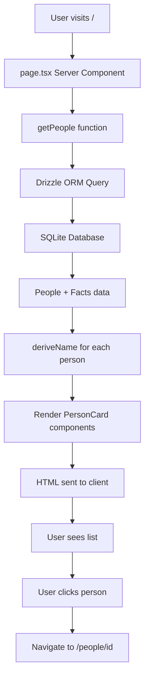

# Design Document: People Listing Page

## Overview

The people listing page replaces the default Next.js landing page with a functional interface for viewing all people stored in the Shared Storage System. This feature serves as the primary entry point for users and provides navigation to individual person detail pages.

The implementation leverages Next.js 16 Server Components for optimal performance, fetching data directly from the SQLite database using Drizzle ORM's relational query API. The page displays person information with intelligent name derivation logic that gracefully handles missing data, ensuring a consistent user experience even when name facts are incomplete.

Key design decisions:
- **Server Components**: All data fetching occurs server-side, eliminating client-side JavaScript overhead and improving initial page load performance
- **Relational Queries**: Using Drizzle's `db.query` API with the `with` clause to efficiently fetch people and their related facts in a single database query
- **Smart Name Derivation**: Implementing fallback logic that prioritizes full names (givenName + familyName), then single names, and finally displays "Person #[id]" for records without name facts
- **Minimal Client JavaScript**: No interactivity required beyond navigation, keeping the bundle size minimal

## Architecture

### Component Structure

```
app/
└── page.tsx (Server Component)
    ├── Data Fetching Layer
    │   └── getPeople() - Async function
    ├── Display Logic
    │   └── deriveName() - Pure function
    └── UI Components
        ├── PersonList
        ├── PersonCard
        └── EmptyState
```

### Data Flow



### Technology Stack Integration

- **Next.js 16 App Router**: File-based routing with `app/page.tsx` as the landing page
- **React Server Components**: Default rendering strategy for data fetching
- **Drizzle ORM**: Type-safe database queries with relational API
- **SQLite**: Local database storage via better-sqlite3 driver
- **Tailwind CSS**: Utility-first styling with dark mode support
- **TypeScript**: Full type safety from database to UI

## Components and Interfaces

### Server Component: page.tsx

The root page component is an async Server Component that fetches data and renders the UI.

```typescript
// app/page.tsx
import { db } from '@/db/client'
import { people } from '@/db/schema'
import Link from 'next/link'

async function getPeople() {
  return db.query.people.findMany({
    with: {
      facts: true,
    },
    orderBy: (people, { desc }) => [desc(people.createdAt)],
  })
}

export default async function PeoplePage() {
  const peopleList = await getPeople()
  
  if (peopleList.length === 0) {
    return <EmptyState />
  }
  
  return (
    <main className="min-h-screen bg-zinc-50 dark:bg-black">
      <div className="max-w-4xl mx-auto px-4 py-12">
        <h1 className="text-3xl font-semibold mb-8 text-black dark:text-zinc-50">
          People
        </h1>
        <div className="space-y-4">
          {peopleList.map((person) => (
            <PersonCard key={person.id} person={person} />
          ))}
        </div>
      </div>
    </main>
  )
}
```

### Data Fetching Function

```typescript
type PersonWithFacts = {
  id: number
  createdAt: Date
  facts: Array<{
    id: number
    personId: number
    key: string
    value: string
    createdAt: Date
  }>
}

async function getPeople(): Promise<PersonWithFacts[]> {
  return db.query.people.findMany({
    with: {
      facts: true,
    },
    orderBy: (people, { desc }) => [desc(people.createdAt)],
  })
}
```

**Query Characteristics**:
- Uses relational query API for type-safe nested data fetching
- Includes all facts for each person via `with: { facts: true }`
- Orders by creation date (newest first) for chronological display
- Returns fully typed result with TypeScript inference

### Name Derivation Logic

```typescript
function deriveName(person: PersonWithFacts): string {
  const givenName = person.facts.find(f => f.key === 'givenName')?.value
  const familyName = person.facts.find(f => f.key === 'familyName')?.value
  
  if (givenName && familyName) {
    return `${givenName} ${familyName}`
  }
  
  if (givenName) {
    return givenName
  }
  
  if (familyName) {
    return familyName
  }
  
  return `Person #${person.id}`
}
```

**Derivation Rules**:
1. If both givenName and familyName exist: return "givenName familyName"
2. If only givenName exists: return givenName
3. If only familyName exists: return familyName
4. If neither exists: return "Person #[id]"

### PersonCard Component

```typescript
function PersonCard({ person }: { person: PersonWithFacts }) {
  const displayName = deriveName(person)
  const formattedDate = new Intl.DateTimeFormat('en-US', {
    dateStyle: 'medium',
  }).format(person.createdAt)
  
  return (
    <Link
      href={`/people/${person.id}`}
      className="block p-6 bg-white dark:bg-zinc-900 rounded-lg border border-zinc-200 dark:border-zinc-800 hover:border-zinc-300 dark:hover:border-zinc-700 transition-colors"
    >
      <h2 className="text-xl font-medium text-black dark:text-zinc-50 mb-2">
        {displayName}
      </h2>
      <p className="text-sm text-zinc-600 dark:text-zinc-400">
        Added {formattedDate}
      </p>
    </Link>
  )
}
```

### EmptyState Component

```typescript
function EmptyState() {
  return (
    <main className="min-h-screen bg-zinc-50 dark:bg-black flex items-center justify-center">
      <div className="max-w-md text-center px-4">
        <h1 className="text-2xl font-semibold text-black dark:text-zinc-50 mb-4">
          No People Yet
        </h1>
        <p className="text-zinc-600 dark:text-zinc-400 mb-6">
          There are currently no people in the system. People can be added through the API endpoints.
        </p>
        <p className="text-sm text-zinc-500 dark:text-zinc-500">
          Use POST /api/people to create a new person record.
        </p>
      </div>
    </main>
  )
}
```

## Data Models

### Database Schema

The existing schema defines the people and facts tables with proper relations:

```typescript
// db/schema.ts (existing)
export const people = sqliteTable('people', {
  id: integer('id').primaryKey({ autoIncrement: true }),
  createdAt: integer('created_at', { mode: 'timestamp' }).notNull().$defaultFn(() => new Date()),
})

export const facts = sqliteTable('facts', {
  id: integer('id').primaryKey({ autoIncrement: true }),
  personId: integer('person_id').notNull().references(() => people.id, { onDelete: 'cascade' }),
  key: text('key').notNull(),
  value: text('value').notNull(),
  createdAt: integer('created_at', { mode: 'timestamp' }).notNull().$defaultFn(() => new Date()),
})

export const peopleRelations = relations(people, ({ many }) => ({
  facts: many(facts),
  activities: many(activities),
  training: many(training),
}))
```

### Type Definitions

```typescript
import { InferSelectModel } from 'drizzle-orm'
import { people, facts } from '@/db/schema'

// Base types inferred from schema
type Person = InferSelectModel<typeof people>
type Fact = InferSelectModel<typeof facts>

// Composite type for query results
type PersonWithFacts = Person & {
  facts: Fact[]
}

// Name fact keys
type NameFactKey = 'givenName' | 'familyName'
```

### Data Relationships

- **One-to-Many**: Each person has zero or more facts
- **Cascade Delete**: Deleting a person removes all associated facts
- **Fact Keys**: Name-related facts use keys 'givenName' and 'familyName'
- **Timestamps**: All records include creation timestamps for audit trails

## Correctness Properties


*A property is a characteristic or behavior that should hold true across all valid executions of a system—essentially, a formal statement about what the system should do. Properties serve as the bridge between human-readable specifications and machine-verifiable correctness guarantees.*

### Property 1: Query Completeness

*For any* database state containing N people with their associated facts, the getPeople query should return exactly N people, each with all their associated facts included.

**Validates: Requirements 2.1, 2.2**

### Property 2: Name Derivation Correctness

*For any* person record with facts:
- If both givenName and familyName facts exist, deriveName returns "{givenName} {familyName}"
- If only givenName exists, deriveName returns the givenName value
- If only familyName exists, deriveName returns the familyName value  
- If neither exists, deriveName returns "Person #{id}"

**Validates: Requirements 3.1, 3.2, 3.3, 3.4**

### Property 3: Date Formatting

*For any* person record with a createdAt timestamp, the formatted date string should be a valid human-readable date representation that can be parsed back to a date within the same day.

**Validates: Requirements 3.5**

### Property 4: Link Generation

*For any* person record with id N, the rendered output should contain a link element with href="/people/N".

**Validates: Requirements 4.1, 4.2**

## Error Handling

### Database Connection Failures

When the database connection fails or the query throws an error, Next.js will automatically catch the error and render the nearest `error.tsx` boundary. For the initial implementation, we rely on Next.js default error handling.

**Future Enhancement**: Create a custom `app/error.tsx` to provide a user-friendly error message:

```typescript
'use client'

export default function Error({
  error,
  reset,
}: {
  error: Error & { digest?: string }
  reset: () => void
}) {
  return (
    <div className="min-h-screen bg-zinc-50 dark:bg-black flex items-center justify-center">
      <div className="max-w-md text-center px-4">
        <h1 className="text-2xl font-semibold text-black dark:text-zinc-50 mb-4">
          Something went wrong
        </h1>
        <p className="text-zinc-600 dark:text-zinc-400 mb-6">
          Unable to load people from the database.
        </p>
        <button
          onClick={reset}
          className="px-4 py-2 bg-black dark:bg-white text-white dark:text-black rounded-lg"
        >
          Try again
        </button>
      </div>
    </div>
  )
}
```

### Empty State Handling

The empty state is not an error condition but a valid application state. When `peopleList.length === 0`, the EmptyState component renders with helpful guidance for users.

### Missing Data Handling

The name derivation logic gracefully handles missing facts by implementing a fallback chain. This ensures the UI never displays undefined or null values, maintaining a consistent user experience.

## Testing Strategy

### Dual Testing Approach

This feature requires both unit tests and property-based tests for comprehensive coverage:

- **Unit tests**: Verify specific examples, edge cases, and integration points
- **Property tests**: Verify universal properties across randomized inputs

### Property-Based Testing

**Library**: Use `fast-check` for TypeScript property-based testing

**Configuration**: Each property test must run a minimum of 100 iterations to ensure adequate coverage through randomization.

**Test Tagging**: Each property test must include a comment referencing the design document property:
```typescript
// Feature: people-listing-page, Property 2: Name Derivation Correctness
```

**Property Test Implementations**:

1. **Query Completeness Property**
   - Generate random database states with varying numbers of people and facts
   - Execute getPeople query
   - Assert returned count matches expected count
   - Assert each person includes all their facts

2. **Name Derivation Property**
   - Generate random person records with different fact combinations:
     - Both givenName and familyName present
     - Only givenName present
     - Only familyName present
     - Neither present
   - Apply deriveName function
   - Assert output matches expected format for each case

3. **Date Formatting Property**
   - Generate random timestamps
   - Format using the date formatter
   - Parse the formatted string back to a date
   - Assert the parsed date is within the same calendar day

4. **Link Generation Property**
   - Generate random person IDs
   - Render PersonCard component
   - Assert href attribute equals `/people/{id}`

### Unit Testing

**Focus Areas**:
- Empty state rendering when no people exist
- Integration between getPeople and page component
- PersonCard component rendering with specific example data
- EmptyState component content verification

**Example Unit Tests**:

```typescript
describe('PeoplePage', () => {
  it('renders empty state when no people exist', async () => {
    // Mock database to return empty array
    const html = await renderPage()
    expect(html).toContain('No People Yet')
  })

  it('renders person cards for existing people', async () => {
    // Mock database with sample data
    const html = await renderPage()
    expect(html).toContain('John Doe')
  })
})

describe('deriveName', () => {
  it('returns full name when both facts exist', () => {
    const person = createPersonWithFacts([
      { key: 'givenName', value: 'John' },
      { key: 'familyName', value: 'Doe' }
    ])
    expect(deriveName(person)).toBe('John Doe')
  })

  it('returns fallback for person without name facts', () => {
    const person = createPersonWithFacts([])
    expect(deriveName(person)).toBe('Person #123')
  })
})
```

### Testing Balance

- Property tests handle comprehensive input coverage across all valid combinations
- Unit tests focus on specific examples, integration points, and edge cases
- Together they provide confidence in both general correctness and specific scenarios

### Test Organization

```
tests/
├── unit/
│   ├── page.test.tsx
│   ├── deriveName.test.ts
│   └── components.test.tsx
└── properties/
    ├── query-completeness.test.ts
    ├── name-derivation.test.ts
    ├── date-formatting.test.ts
    └── link-generation.test.ts
```
