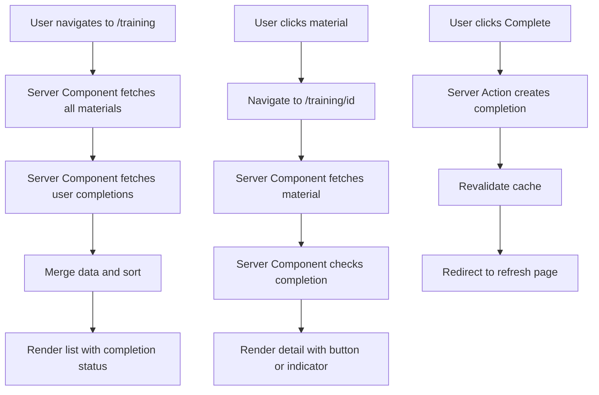

# Design Document: Training Listing Display

## Overview

This feature implements two primary pages for the training system: a listing page that displays all available training materials with completion status, and a detail page that shows individual training content with the ability to mark completion. The design leverages Next.js 16 Server Components for optimal performance and Drizzle ORM for type-safe database operations.

The system integrates with the existing authentication layer to track per-user completion history and uses Server Actions for mutations. The architecture follows Next.js App Router conventions with file-based routing, server-side data fetching, and cache revalidation strategies.

### Key Design Decisions

1. **Server Components First**: Both pages use Server Components for data fetching to minimize client-side JavaScript and improve initial load performance
2. **Server Actions for Mutations**: Completion marking uses Server Actions rather than API routes for better integration with Next.js caching
3. **Relational Queries**: Drizzle's relational query API fetches user completion history with material details in a single database query
4. **Optimistic UI Updates**: After marking completion, the page redirects to refresh server-rendered content rather than client-side state management
5. **Type Safety**: All database operations use TypeScript types inferred from the Drizzle schema

## Architecture

### Component Structure

```
app/
├── training/
│   ├── page.tsx                    # Training list page (Server Component)
│   ├── [id]/
│   │   ├── page.tsx                # Training detail page (Server Component)
│   │   └── actions.ts              # Server Actions for completion
│   └── loading.tsx                 # Loading state for training pages
└── dashboard/
    └── page.tsx                    # Updated with link to training
```

### Data Flow



### Database Interaction

The design uses existing database schema and functions from `lib/training.ts`:

- `getUserCompletionHistory(userId)`: Fetches all completions with material details
- `recordTrainingCompletion(userId, materialId)`: Creates completion record
- `hasUserCompletedMaterial(userId, materialId)`: Checks completion status
- Drizzle relational queries for fetching all training materials

## Components and Interfaces

### Training List Page (`app/training/page.tsx`)

**Purpose**: Display all training materials with completion indicators, sorted by completion status

**Type**: Server Component (async)

**Data Requirements**:
- All training materials from database
- Current user's completion history
- User session for authentication

**Key Functions**:
```typescript
async function getTrainingListData(userId: number) {
  // Fetch all materials
  const materials = await db.query.trainingMaterials.findMany({
    orderBy: (materials, { asc }) => [asc(materials.title)]
  })
  
  // Fetch user completions
  const completions = await getUserCompletionHistory(userId)
  const completedIds = new Set(completions.map(c => c.materialId))
  
  // Merge and sort: uncompleted first, then completed
  const enriched = materials.map(m => ({
    ...m,
    completed: completedIds.has(m.id)
  }))
  
  return enriched.sort((a, b) => {
    if (a.completed === b.completed) return 0
    return a.completed ? 1 : -1
  })
}
```

**UI Elements**:
- Page header with title
- List of training material cards
- Each card shows: title, category, completion badge, link to detail
- Visual distinction between completed and uncompleted items
- Link back to dashboard

### Training Detail Page (`app/training/[id]/page.tsx`)

**Purpose**: Display full training material content with completion functionality

**Type**: Server Component (async)

**Data Requirements**:
- Training material by ID
- User session for authentication
- Completion status for current user

**Key Functions**:
```typescript
async function getTrainingDetailData(materialId: number, userId: number) {
  // Fetch material
  const material = await db.query.trainingMaterials.findFirst({
    where: (materials, { eq }) => eq(materials.id, materialId)
  })
  
  if (!material) {
    notFound() // Triggers 404 page
  }
  
  // Check completion status
  const completed = await hasUserCompletedMaterial(userId, materialId)
  
  return { material, completed }
}
```

**UI Elements**:
- Material title
- Category badge
- Full content display (formatted text)
- Completion button (if not completed) OR completion indicator (if completed)
- Back link to training list
- Success message display (via URL search params)

### Completion Form Component

**Purpose**: Handle completion button interaction

**Type**: Form using Server Action

**Implementation**:
```typescript
// Inline form in detail page
<form action={completeTraining}>
  <input type="hidden" name="materialId" value={materialId} />
  <button type="submit">Mark as Complete</button>
</form>
```

### Server Actions (`app/training/[id]/actions.ts`)

**Purpose**: Handle training completion mutations

**Functions**:

```typescript
'use server'

import { revalidatePath } from 'next/cache'
import { redirect } from 'next/navigation'
import { requireSession } from '@/lib/session'
import { recordTrainingCompletion } from '@/lib/training'

export async function completeTraining(formData: FormData) {
  // Get authenticated user
  const { user } = await requireSession()
  
  // Extract and validate material ID
  const materialIdStr = formData.get('materialId') as string
  const materialId = parseInt(materialIdStr, 10)
  
  if (isNaN(materialId)) {
    return { error: 'Invalid training material ID' }
  }
  
  // Record completion
  const result = await recordTrainingCompletion(user.id, materialId)
  
  if (!result.success) {
    return { error: result.error }
  }
  
  // Revalidate training list cache
  revalidatePath('/training')
  
  // Redirect with success message
  redirect(`/training/${materialId}?completed=true`)
}
```

## Data Models

The feature uses existing database schema from `db/schema.ts`:

### Training Materials Table

```typescript
trainingMaterials {
  id: integer (primary key, auto-increment)
  title: text (not null)
  content: text (not null)
  categoryId: text (not null)
  createdAt: timestamp (not null, default now)
  updatedAt: timestamp (not null, auto-update)
}
```

### Training Completions Table

```typescript
trainingCompletions {
  id: integer (primary key, auto-increment)
  userId: integer (not null, foreign key to users)
  materialId: integer (not null, foreign key to trainingMaterials)
  completedAt: timestamp (not null, default now)
  synced: boolean (not null, default false)
  lastSyncedAt: timestamp (nullable)
  remoteId: text (nullable)
  
  // Constraints
  unique(userId, materialId)
  index on userId
  index on materialId
}
```

### Type Definitions

```typescript
// Inferred from schema
type TrainingMaterial = typeof trainingMaterials.$inferSelect
type TrainingCompletion = typeof trainingCompletions.$inferSelect

// Enriched types for UI
type TrainingListItem = TrainingMaterial & {
  completed: boolean
}

type TrainingDetailData = {
  material: TrainingMaterial
  completed: boolean
}
```

## Correctness Properties

*A property is a characteristic or behavior that should hold true across all valid executions of a system—essentially, a formal statement about what the system should do. Properties serve as the bridge between human-readable specifications and machine-verifiable correctness guarantees.*


### Property 1: All materials displayed in list

*For any* set of training materials in the database, when fetching the training list, all materials should be present in the returned list.

**Validates: Requirements 1.1**

### Property 2: List items contain required fields

*For any* training material in the list, the rendered output should contain the material's title and category identifier.

**Validates: Requirements 1.2, 1.3**

### Property 3: List items have navigation links

*For any* training material in the list, the rendered output should contain a link to `/training/[id]` where [id] is the material's identifier.

**Validates: Requirements 1.4**

### Property 4: Completion status indicated in list

*For any* set of training materials and user completions, the rendered list should display completion indicators only for materials the user has completed.

**Validates: Requirements 1.5**

### Property 5: Uncompleted materials sorted first

*For any* training list with both completed and uncompleted materials, all uncompleted materials should appear before all completed materials in the rendered order.

**Validates: Requirements 1.6**

### Property 6: Detail page contains required fields

*For any* training material, the rendered detail page should contain the material's title, full content, and category identifier.

**Validates: Requirements 2.1, 2.2, 2.3**

### Property 7: Completion UI renders based on status

*For any* training material and user, if the user has not completed the material, the detail page should display a completion button; if the user has completed the material, the detail page should display a completion indicator instead.

**Validates: Requirements 3.1, 3.4**

### Property 8: Completion creates database record

*For any* user and uncompleted training material, when the completion action is triggered, a completion record should exist in the database for that user-material pair.

**Validates: Requirements 3.2**

### Property 9: Completion is idempotent

*For any* user and training material, attempting to complete the same material multiple times should result in exactly one completion record in the database.

**Validates: Requirements 3.6**

### Property 10: Completions associated with correct user

*For any* completion record created through the system, the record's userId should match the authenticated user's identifier.

**Validates: Requirements 4.4**

### Property 11: Success message after completion

*For any* training material, when a user successfully completes it, the system should display a success message.

**Validates: Requirements 5.4**

### Property 12: Material ID validation

*For any* non-integer or invalid material identifier, the system should reject the request before querying the database.

**Validates: Requirements 6.4**

## Error Handling

### Client-Facing Errors

The system handles errors at multiple levels to provide clear feedback to users:

**Not Found Errors (404)**:
- When a training material ID doesn't exist, Next.js `notFound()` function triggers the 404 page
- Custom `app/training/[id]/not-found.tsx` provides user-friendly messaging
- Includes link back to training list

**Database Errors**:
- Database connection failures caught in Server Components
- Displayed via `error.tsx` boundary with retry option
- Logs error details server-side for debugging

**Validation Errors**:
- Invalid material IDs (non-integer, negative) rejected in Server Action
- Returns error object: `{ error: 'Invalid training material ID' }`
- Displayed inline on the page

**Completion Errors**:
- Duplicate completion attempts handled gracefully (already tested in lib/training.ts)
- Foreign key violations return descriptive error messages
- User can retry after transient failures

### Error Boundary Structure

```typescript
// app/training/error.tsx
'use client'

export default function TrainingError({
  error,
  reset,
}: {
  error: Error & { digest?: string }
  reset: () => void
}) {
  return (
    <div>
      <h2>Failed to load training materials</h2>
      <p>There was a problem loading the training content.</p>
      <button onClick={reset}>Try Again</button>
      <Link href="/dashboard">Return to Dashboard</Link>
    </div>
  )
}
```

### Loading States

```typescript
// app/training/loading.tsx
export default function TrainingLoading() {
  return (
    <div className="animate-pulse">
      <div className="h-8 bg-gray-200 rounded w-1/4 mb-4" />
      <div className="space-y-4">
        {[1, 2, 3].map(i => (
          <div key={i} className="h-24 bg-gray-200 rounded" />
        ))}
      </div>
    </div>
  )
}
```

## Testing Strategy

### Dual Testing Approach

This feature requires both unit tests and property-based tests for comprehensive coverage:

**Unit Tests** focus on:
- Specific routing examples (routes exist at `/training` and `/training/[id]`)
- Edge cases (non-existent material IDs, database unavailable)
- Integration points (dashboard navigation link exists)
- Error handling (database failures, validation errors)

**Property-Based Tests** focus on:
- Universal properties across all inputs (all materials displayed, correct sorting)
- Rendering completeness (required fields present)
- Data integrity (completions associated with correct user)
- Idempotency (duplicate completion attempts)

### Property-Based Testing Configuration

**Library**: fast-check (JavaScript/TypeScript property-based testing library)

**Configuration**:
- Minimum 100 iterations per property test
- Each test tagged with feature name and property reference
- Tag format: `Feature: training-listing-display, Property {number}: {property_text}`

**Example Test Structure**:
```typescript
import fc from 'fast-check'
import { describe, it, expect } from 'vitest'

describe('Feature: training-listing-display', () => {
  it('Property 1: All materials displayed in list', async () => {
    await fc.assert(
      fc.asyncProperty(
        fc.array(arbitraryTrainingMaterial()),
        async (materials) => {
          // Setup: Insert materials into test database
          // Action: Fetch training list
          // Assert: All materials present in result
        }
      ),
      { numRuns: 100 }
    )
  })
})
```

### Test Data Generators

Property tests require generators for random test data:

```typescript
// Arbitrary training material
const arbitraryTrainingMaterial = () => fc.record({
  title: fc.string({ minLength: 1, maxLength: 100 }),
  content: fc.string({ minLength: 10, maxLength: 1000 }),
  categoryId: fc.string({ minLength: 1, maxLength: 50 })
})

// Arbitrary user ID (positive integer)
const arbitraryUserId = () => fc.integer({ min: 1, max: 10000 })

// Arbitrary material ID (positive integer)
const arbitraryMaterialId = () => fc.integer({ min: 1, max: 10000 })
```

### Unit Test Coverage

Unit tests should cover:

1. **Routing Configuration**:
   - `/training` route renders training list page
   - `/training/[id]` route renders training detail page
   - Dashboard contains link to `/training`

2. **Edge Cases**:
   - Non-existent material ID returns 404
   - Invalid material ID (non-integer) rejected
   - Database connection failure displays error

3. **UI Components**:
   - Loading state displays while fetching data
   - Error boundary catches and displays errors
   - Success message appears after completion

4. **Server Actions**:
   - completeTraining validates input
   - completeTraining revalidates cache
   - completeTraining redirects after success

### Integration Testing

Integration tests verify the complete flow:

1. User navigates to `/training`
2. List displays with completion status
3. User clicks material link
4. Detail page loads with correct content
5. User clicks completion button
6. Completion recorded in database
7. Page refreshes with completion indicator
8. List page shows updated completion status

### Performance Testing

Performance requirements from Requirement 7:

- Server Component rendering time < 200ms for list page
- Server Component rendering time < 100ms for detail page
- Database query time < 50ms for relational queries
- Cache revalidation completes within 100ms

These are measured through load testing rather than unit/property tests.
