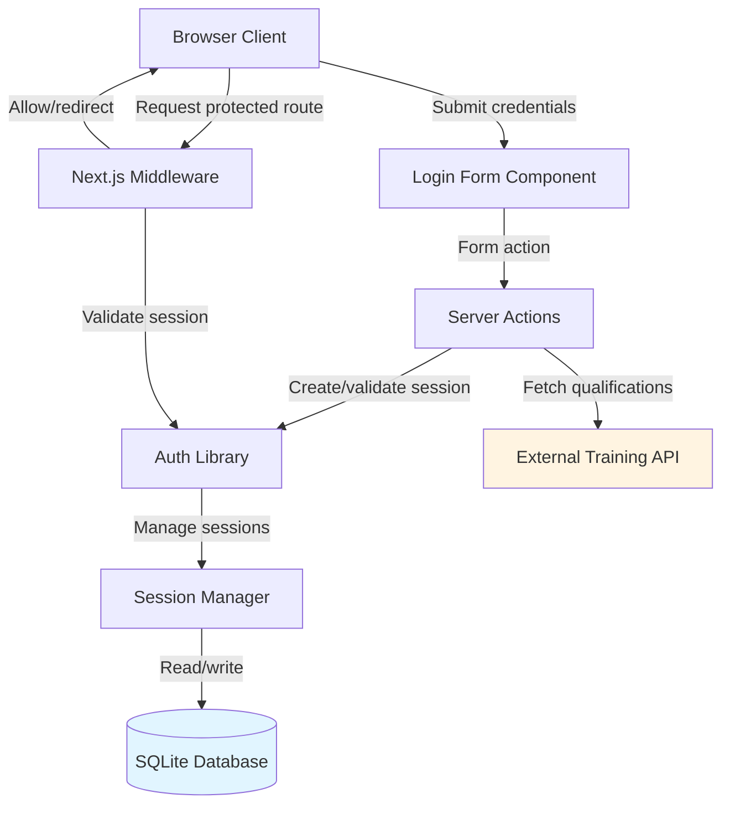

# Design Document: User Authentication and Session Management

## Overview

This design implements a simple local authentication system for the patient health reporting application. The system identifies staff members through auto-incrementing user identifiers and manages their sessions using HTTP-only cookies with server-side validation.

The authentication mechanism prioritizes simplicity over complex security features, as the application is designed for internal use by trained staff. Users register through a login form that creates a user record with a sequential identifier. Sessions are managed server-side with cryptographically secure tokens stored in HTTP-only cookies, providing protection against XSS attacks while maintaining ease of use.

Key architectural decisions:
- SQLite database with Drizzle ORM for all persistent data (users and sessions)
- Next.js middleware for route protection and session validation
- Server Actions for authentication operations (login/logout)
- React Server Components for accessing user context
- Training qualifications retrieved from external API (not stored locally)

The design leverages Next.js 16 App Router patterns with Server Components as the default, using Client Components only where interactivity is required. Session validation occurs on every request to protected routes through middleware, ensuring consistent security without requiring manual checks in individual route handlers.

## Architecture

### System Components



### Request Flow

**Authentication Flow:**
1. User submits login form (Server Action)
2. Server Action validates credentials against database
3. Session Manager generates cryptographically secure token
4. Session record created in database with user ID and expiration
5. Token stored in HTTP-only cookie
6. User redirected to main application page

**Protected Route Access Flow:**
1. Browser sends request with session cookie
2. Middleware intercepts request
3. Middleware validates session token against database
4. If valid and not expired: request proceeds
5. If invalid/expired: redirect to login page

**Session Validation:**
- Occurs on every request to protected routes
- Checks token existence in database
- Verifies expiration timestamp (8-hour lifetime)
- Expired sessions automatically removed from database

### Technology Stack Integration

- **Next.js 16 App Router**: File-based routing with middleware for route protection
- **React Server Components**: Default for all pages, accessing user context server-side
- **Server Actions**: Handle form submissions for login/logout
- **Drizzle ORM**: Type-safe database operations with SQLite
- **better-sqlite3**: Synchronous SQLite driver for optimal performance
- **Middleware**: Session validation and route protection logic

## Components and Interfaces

### Database Layer

**Location:** `db/schema.ts`

```typescript
import { sqliteTable, integer, text } from 'drizzle-orm/sqlite-core';

export const users = sqliteTable('users', {
  id: integer('id').primaryKey({ autoIncrement: true }),
  name: text('name').notNull(),
  email: text('email').notNull().unique(),
  createdAt: integer('created_at', { mode: 'timestamp' }).notNull(),
});

export const sessions = sqliteTable('sessions', {
  id: text('id').primaryKey(), // Cryptographically secure random token
  userId: integer('user_id').notNull().references(() => users.id, { onDelete: 'cascade' }),
  expiresAt: integer('expires_at', { mode: 'timestamp' }).notNull(),
  createdAt: integer('created_at', { mode: 'timestamp' }).notNull(),
});
```

**Database Connection:** `db/index.ts`

```typescript
import { drizzle } from 'drizzle-orm/better-sqlite3';
import Database from 'better-sqlite3';
import * as schema from './schema';

const sqlite = new Database('local.db');
export const db = drizzle(sqlite, { schema });
```

### Authentication Library

**Location:** `lib/auth.ts`

Provides core authentication functions for session management and user context access.

```typescript
// Core functions
export async function createSession(userId: number): Promise<string>
export async function validateSession(token: string): Promise<{ user: User; session: Session } | null>
export async function invalidateSession(token: string): Promise<void>
export async function getCurrentUser(): Promise<User | null>
export async function requireAuth(): Promise<User>
export async function cleanupExpiredSessions(): Promise<void>
```

**Session Token Generation:**
- Uses `crypto.randomBytes(32)` for 256 bits of entropy
- Encoded as base64url string
- Stored as primary key in sessions table

**Session Validation Logic:**
1. Query session by token
2. Check if session exists
3. Verify expiration timestamp
4. If expired: delete session and return null
5. If valid: return user and session data

### Server Actions

**Location:** `app/actions/auth.ts`

```typescript
'use server'

export async function login(formData: FormData): Promise<{ error?: string }>
export async function logout(): Promise<void>
```

**Login Action:**
- Validates form data (non-empty fields)
- Queries user by email
- Creates session via auth library
- Sets HTTP-only cookie with session token
- Redirects to main page on success
- Returns error object on failure

**Logout Action:**
- Retrieves session token from cookies
- Invalidates session in database
- Clears session cookie
- Redirects to login page

### Middleware

**Location:** `middleware.ts`

```typescript
import { NextResponse } from 'next/server';
import type { NextRequest } from 'next/server';

export async function middleware(request: NextRequest): Promise<NextResponse>

export const config = {
  matcher: ['/((?!api|_next/static|_next/image|favicon.ico).*)'],
};
```

**Middleware Logic:**
- Runs on all routes except static assets and API routes
- Extracts session token from cookies
- Validates session using auth library
- Protected routes (all except `/login`):
  - No valid session → redirect to `/login`
  - Valid session → allow request
- Login route (`/login`):
  - Valid session → redirect to `/` (already authenticated)
  - No session → allow request

### Login Form Component

**Location:** `app/login/page.tsx`

Server Component that renders the login form.

```typescript
export default function LoginPage(): JSX.Element
```

**Form Component:** `app/login/components/LoginForm.tsx`

Client Component for form interactivity.

```typescript
'use client'

export function LoginForm(): JSX.Element
```

**Features:**
- Email and name input fields
- Submit button with loading state (using `useFormStatus`)
- Error message display
- Form submission via Server Action
- Client-side validation for empty fields

### User Context Access

**Usage in Server Components:**

```typescript
import { getCurrentUser, requireAuth } from '@/lib/auth';

// Optional authentication
export default async function DashboardPage() {
  const user = await getCurrentUser();
  if (!user) {
    // Handle unauthenticated state
  }
  return <div>Welcome, {user.name}</div>;
}

// Required authentication (throws if not authenticated)
export default async function ProfilePage() {
  const user = await requireAuth();
  return <div>Profile for {user.name}</div>;
}
```

## Data Models

### User Model

```typescript
type User = {
  id: number;              // Auto-incrementing primary key
  name: string;            // User's display name
  email: string;           // Unique email identifier
  createdAt: Date;         // Registration timestamp
}

type NewUser = {
  name: string;
  email: string;
  createdAt: Date;
}
```

**Constraints:**
- `id`: Primary key, auto-increment starting from 1
- `email`: Unique constraint
- `name`: Not null
- `email`: Not null

**Notes:**
- Training qualifications are NOT stored in this model
- Qualifications retrieved from external API when needed
- User record serves only for identification purposes

### Session Model

```typescript
type Session = {
  id: string;              // Cryptographically secure token (primary key)
  userId: number;          // Foreign key to users.id
  expiresAt: Date;         // Session expiration timestamp
  createdAt: Date;         // Session creation timestamp
}

type NewSession = {
  id: string;
  userId: number;
  expiresAt: Date;
  createdAt: Date;
}
```

**Constraints:**
- `id`: Primary key (session token)
- `userId`: Foreign key with cascade delete
- `expiresAt`: Not null
- Session lifetime: 8 hours from creation

**Token Format:**
- 32 random bytes (256 bits of entropy)
- Base64url encoded string
- Example: `"xK7j9mP2nQ8vR5wT1yU4zL6bN3cM8dF0"`

### Cookie Configuration

```typescript
type SessionCookie = {
  name: 'session';
  value: string;           // Session token
  httpOnly: true;          // Prevents JavaScript access
  secure: boolean;         // true in production (HTTPS)
  sameSite: 'lax';        // CSRF protection
  maxAge: number;          // 8 hours in seconds
  path: '/';
}
```

**Security Attributes:**
- `httpOnly`: Prevents XSS attacks by blocking JavaScript access
- `secure`: Ensures cookie only sent over HTTPS in production
- `sameSite: 'lax'`: Protects against CSRF while allowing normal navigation
- `maxAge`: Matches session expiration (8 hours = 28800 seconds)

