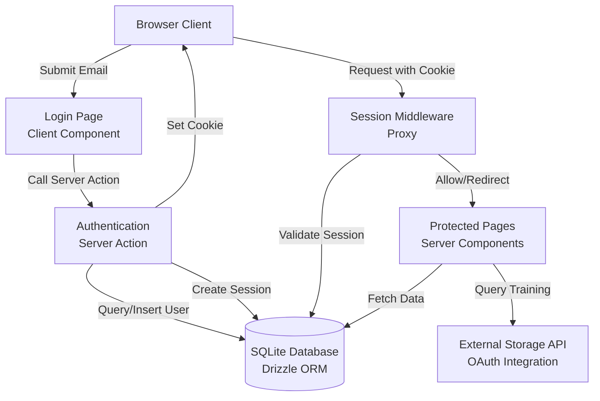

# Design Document: User Authentication

## Overview

This design implements immediate trust-based email authentication for the training application. The system replaces the existing incrementing identifier approach with email-based authentication while maintaining compatibility with the OAuth 2 storage system integration.

The authentication flow is intentionally simple: users enter their email address and are immediately authenticated. No passwords, verification codes, or rate limiting are implemented. This design prioritizes ease of access while providing session management and protected route functionality.

### Key Design Decisions

1. **Immediate Trust Model**: Email addresses are trusted without verification, creating or authenticating users in a single step
2. **Session-Based Authentication**: HTTP-only cookies store session tokens with 7-day expiration
3. **Server Components First**: Leverage Next.js 16 Server Components for authentication checks and data fetching
4. **Drizzle ORM with SQLite**: Type-safe database operations with better-sqlite3 for local storage
5. **Migration Strategy**: Preserve existing user data and OAuth tokens during migration from incrementing identifiers

## Architecture

### System Components



### Authentication Flow

1. User submits email address via login form (Client Component)
2. Server Action validates email format
3. Server Action queries database for existing user or creates new user
4. Server Action generates cryptographically secure session token
5. Server Action stores session with 7-day expiration
6. Server Action sets HTTP-only cookie with session token
7. Server Action redirects to dashboard or originally requested URL
8. If user has OAuth token, query Storage API for new training records

### Session Validation Flow

1. User requests protected route
2. Proxy (middleware) extracts session token from cookie
3. Proxy queries database for valid, non-expired session
4. If valid: allow request to proceed
5. If invalid/expired: redirect to login page with return URL

## Components and Interfaces

### Database Schema

Using Drizzle ORM with SQLite (better-sqlite3 driver):

```typescript
// db/schema.ts
import { sqliteTable, integer, text } from 'drizzle-orm/sqlite-core';
import { sql } from 'drizzle-orm';

export const users = sqliteTable('users', {
  id: integer('id').primaryKey({ autoIncrement: true }),
  email: text('email').notNull().unique(),
  createdAt: integer('created_at', { mode: 'timestamp' })
    .notNull()
    .default(sql`(unixepoch())`),
  updatedAt: integer('updated_at', { mode: 'timestamp' })
    .notNull()
    .default(sql`(unixepoch())`)
    .$onUpdate(() => new Date()),
});

export const sessions = sqliteTable('sessions', {
  id: integer('id').primaryKey({ autoIncrement: true }),
  userId: integer('user_id')
    .notNull()
    .references(() => users.id, { onDelete: 'cascade' }),
  token: text('token').notNull().unique(),
  expiresAt: integer('expires_at', { mode: 'timestamp' }).notNull(),
  createdAt: integer('created_at', { mode: 'timestamp' })
    .notNull()
    .default(sql`(unixepoch())`),
});

// Type inference
export type User = typeof users.$inferSelect;
export type NewUser = typeof users.$inferInsert;
export type Session = typeof sessions.$inferSelect;
export type NewSession = typeof sessions.$inferInsert;
```

### Database Connection

```typescript
// db/index.ts
import { drizzle } from 'drizzle-orm/better-sqlite3';
import Database from 'better-sqlite3';
import * as schema from './schema';

const sqlite = new Database('training.db');
export const db = drizzle(sqlite, { schema });
```

### Server Actions

```typescript
// app/auth/actions.ts
'use server'

import { db } from '@/db';
import { users, sessions } from '@/db/schema';
import { eq } from 'drizzle-orm';
import { cookies } from 'next/headers';
import { redirect } from 'next/navigation';
import { randomBytes } from 'crypto';

export async function authenticate(formData: FormData) {
  const email = formData.get('email') as string;

  // Validate email format
  if (!isValidEmail(email)) {
    return { error: 'Invalid email format' };
  }

  try {
    // Find or create user
    let user = await db.query.users.findFirst({
      where: eq(users.email, email.toLowerCase()),
    });

    if (!user) {
      const [newUser] = await db.insert(users)
        .values({ email: email.toLowerCase() })
        .returning();
      user = newUser;
    }

    // Generate session token
    const token = randomBytes(32).toString('base64url');
    const expiresAt = new Date(Date.now() + 7 * 24 * 60 * 60 * 1000); // 7 days

    // Create session
    await db.insert(sessions).values({
      userId: user.id,
      token,
      expiresAt,
    });

    // Set cookie
    const cookieStore = await cookies();
    cookieStore.set('session', token, {
      httpOnly: true,
      secure: process.env.NODE_ENV === 'production',
      sameSite: 'lax',
      expires: expiresAt,
      path: '/',
    });

    // TODO: If user has OAuth token, query Storage API for new training records

  } catch (error) {
    console.error('Authentication error:', error);
    return { error: 'Authentication failed' };
  }

  redirect('/dashboard');
}

export async function logout() {
  const cookieStore = await cookies();
  const token = cookieStore.get('session')?.value;

  if (token) {
    // Delete session from database
    await db.delete(sessions).where(eq(sessions.token, token));
  }

  // Clear cookie
  cookieStore.delete('session');
  redirect('/login');
}

function isValidEmail(email: string): boolean {
  const emailRegex = /^[^\s@]+@[^\s@]+\.[^\s@]+$/;
  return emailRegex.test(email);
}
```

### Session Validation Utility

```typescript
// lib/session.ts
import { db } from '@/db';
import { sessions, users } from '@/db/schema';
import { eq, and, gt } from 'drizzle-orm';
import { cookies } from 'next/headers';
import type { User } from '@/db/schema';

export async function getSession(): Promise<{ user: User } | null> {
  const cookieStore = await cookies();
  const token = cookieStore.get('session')?.value;

  if (!token) return null;

  const session = await db.query.sessions.findFirst({
    where: and(
      eq(sessions.token, token),
      gt(sessions.expiresAt, new Date())
    ),
    with: {
      user: true,
    },
  });

  if (!session) return null;

  return { user: session.user };
}

export async function requireSession(): Promise<{ user: User }> {
  const session = await getSession();
  if (!session) {
    redirect('/login');
  }
  return session;
}
```

### Proxy (Middleware)

```typescript
// proxy.ts
import { NextResponse } from 'next/server';
import type { NextRequest } from 'next/server';

const publicPaths = ['/login', '/api/health'];

export function proxy(request: NextRequest) {
  const { pathname } = request.nextUrl;

  // Allow public paths
  if (publicPaths.some(path => pathname.startsWith(path))) {
    return NextResponse.next();
  }

  // Allow static files
  if (pathname.startsWith('/_next') || pathname.startsWith('/favicon')) {
    return NextResponse.next();
  }

  // Check for session cookie
  const sessionToken = request.cookies.get('session')?.value;

  if (!sessionToken) {
    const loginUrl = new URL('/login', request.url);
    loginUrl.searchParams.set('returnUrl', pathname);
    return NextResponse.redirect(loginUrl);
  }

  // Session validation happens in Server Components via getSession()
  return NextResponse.next();
}

export const config = {
  matcher: ['/((?!_next/static|_next/image|favicon.ico).*)'],
};
```

### Login Page Component

```typescript
// app/login/page.tsx
import { authenticate } from '@/app/auth/actions';
import { getSession } from '@/lib/session';
import { redirect } from 'next/navigation';
import LoginForm from './login-form';

export default async function LoginPage({
  searchParams,
}: {
  searchParams: Promise<{ returnUrl?: string }>;
}) {
  // Redirect if already authenticated
  const session = await getSession();
  if (session) {
    redirect('/dashboard');
  }

  const { returnUrl } = await searchParams;

  return (
    <div className="flex min-h-screen items-center justify-center">
      <div className="w-full max-w-md space-y-8 p-8">
        <div>
          <h2 className="text-3xl font-bold">Sign In</h2>
          <p className="mt-2 text-sm text-gray-600">
            Enter your email to access your training
          </p>
        </div>
        <LoginForm returnUrl={returnUrl} />
      </div>
    </div>
  );
}
```

```typescript
// app/login/login-form.tsx
'use client'

import { authenticate } from '@/app/auth/actions';
import { useFormStatus } from 'react-dom';
import { useState } from 'react';

function SubmitButton() {
  const { pending } = useFormStatus();

  return (
    <button
      type="submit"
      disabled={pending}
      className="w-full rounded-md bg-black px-4 py-2 text-white disabled:opacity-50"
    >
      {pending ? 'Signing in...' : 'Sign In'}
    </button>
  );
}

export default function LoginForm({ returnUrl }: { returnUrl?: string }) {
  const [error, setError] = useState<string | null>(null);

  async function handleSubmit(formData: FormData) {
    setError(null);
    const result = await authenticate(formData);
    if (result?.error) {
      setError(result.error);
    }
  }

  return (
    <form action={handleSubmit} className="space-y-6">
      <div>
        <label htmlFor="email" className="block text-sm font-medium">
          Email address
        </label>
        <input
          id="email"
          name="email"
          type="email"
          autoComplete="email"
          required
          className="mt-1 block w-full rounded-md border border-gray-300 px-3 py-2"
          placeholder="you@example.com"
        />
      </div>

      {error && (
        <div className="rounded-md bg-red-50 p-3 text-sm text-red-800">
          {error}
        </div>
      )}

      <SubmitButton />
    </form>
  );
}
```

### Protected Page Example

```typescript
// app/dashboard/page.tsx
import { requireSession } from '@/lib/session';
import { logout } from '@/app/auth/actions';

export default async function DashboardPage() {
  const { user } = await requireSession();

  return (
    <div className="p-8">
      <div className="flex items-center justify-between">
        <h1 className="text-2xl font-bold">Dashboard</h1>
        <div className="flex items-center gap-4">
          <span className="text-sm text-gray-600">{user.email}</span>
          <form action={logout}>
            <button
              type="submit"
              className="rounded-md bg-gray-200 px-4 py-2 text-sm"
            >
              Sign Out
            </button>
          </form>
        </div>
      </div>

      <div className="mt-8">
        <p>Welcome back! Your training materials will appear here.</p>
      </div>
    </div>
  );
}
```

## Data Models

### User Model

```typescript
{
  id: number;              // Auto-incrementing primary key
  email: string;           // Unique email address (lowercase)
  createdAt: Date;         // Account creation timestamp
  updatedAt: Date;         // Last update timestamp
}
```

### Session Model

```typescript
{
  id: number;              // Auto-incrementing primary key
  userId: number;          // Foreign key to users.id
  token: string;           // Unique session token (base64url, 32 bytes)
  expiresAt: Date;         // Session expiration timestamp (7 days from creation)
  createdAt: Date;         // Session creation timestamp
}
```

### Session Cookie

```typescript
{
  name: 'session';
  value: string;           // Session token
  httpOnly: true;          // Prevents JavaScript access
  secure: boolean;         // true in production
  sameSite: 'lax';        // CSRF protection
  expires: Date;           // Matches session.expiresAt
  path: '/';              // Available site-wide
}
```


## Correctness Properties

A property is a characteristic or behavior that should hold true across all valid executions of a system—essentially, a formal statement about what the system should do. Properties serve as the bridge between human-readable specifications and machine-verifiable correctness guarantees.

### Property Reflection

After analyzing all acceptance criteria, I identified the following redundancies:
- Properties 1.5 and 2.1 both require creating a session and returning a token on authentication (consolidated into Property 1)
- Properties 3.3 and 5.1 both require deleting the session on logout (consolidated into Property 8)
- Properties 8.1 and 8.2 both describe the same cleanup behavior (consolidated into Property 15)
- Properties 6.2 and 6.5 both address referential integrity during migration (consolidated into migration example)

### Property 1: Authentication creates session with token

For any valid email address, when authentication completes successfully, the system should create a session record in the database and return a session token to the client.

**Validates: Requirements 1.1, 1.2, 1.5, 2.1**

### Property 2: Invalid email format rejected

For any string that does not match standard email format (missing @, missing domain, etc.), the authentication system should reject the input and return an error indicating invalid email format.

**Validates: Requirements 1.3, 9.1**

### Property 3: User creation generates unique identifier

For any set of new users created, each user should have a unique identifier that differs from all other users in the system.

**Validates: Requirements 1.4**

### Property 4: Session expiration is 7 days

For any session created, the expiration timestamp should be exactly 7 days (604800 seconds) from the creation timestamp.

**Validates: Requirements 2.2**

### Property 5: Session persisted with correct associations

For any session created, querying the database should return a session record with the correct user identifier, token value, and expiration timestamp.

**Validates: Requirements 2.3**

### Property 6: Session tokens are cryptographically secure

For any set of session tokens generated, each token should be unique, have sufficient length (at least 32 bytes), and be generated using cryptographically secure random generation.

**Validates: Requirements 2.5**

### Property 7: Valid session authenticates request

For any valid, non-expired session token, when included in a request to a protected route, the system should authenticate the request and allow it to proceed.

**Validates: Requirements 3.1, 4.2**

### Property 8: Expired session rejected

For any session token where the expiration timestamp is before the current time, the system should reject the request and redirect to the login page.

**Validates: Requirements 3.2, 9.2**

### Property 9: Logout deletes session and clears cookie

For any valid session, when logout is initiated, the system should delete the session record from the database and clear the session cookie from the client.

**Validates: Requirements 3.3, 5.1, 5.2**

### Property 10: Logout redirects to login

For any logout request, when logout completes, the system should redirect the user to the login page.

**Validates: Requirements 5.3**

### Property 11: Session cookies are HTTP-only

For any session cookie set by the system, the cookie should have the httpOnly flag set to true, preventing JavaScript access.

**Validates: Requirements 3.4**

### Property 12: Unauthenticated requests redirect to login

For any request to a protected route without a valid session token, the system should redirect to the login page.

**Validates: Requirements 4.1, 4.4**

### Property 13: Login redirect preserves return URL

For any unauthenticated request to a protected route, when redirected to the login page, the originally requested URL should be preserved as a query parameter for post-login redirect.

**Validates: Requirements 4.5**

### Property 14: Email uniqueness enforced

For any attempt to insert a user with an email address that already exists in the database, the system should reject the insertion and enforce the unique constraint.

**Validates: Requirements 7.3**

### Property 15: Session token uniqueness enforced

For any attempt to insert a session with a token that already exists in the database, the system should reject the insertion and enforce the unique constraint.

**Validates: Requirements 7.4**

### Property 16: Foreign key cascade on user deletion

For any user with associated sessions, when the user is deleted, all associated sessions should be automatically deleted due to the foreign key cascade relationship.

**Validates: Requirements 7.5**

### Property 17: Cleanup deletes expired sessions

For any set of sessions where some have expiration timestamps before the current time, when the cleanup process runs, all expired sessions should be deleted and all non-expired sessions should remain.

**Validates: Requirements 8.1, 8.2**

## Error Handling

### Email Validation Errors

When a user submits an invalid email format:
- Return error message: "Invalid email format"
- Do not create user or session records
- Maintain current authentication state
- Display error in login form UI

### Session Expiration

When a user attempts to access a protected route with an expired session:
- Redirect to login page with returnUrl parameter
- Clear expired session cookie
- Optionally display message: "Your session has expired. Please sign in again."

### Database Errors

When database operations fail:
- Log detailed error information server-side
- Return generic error message to client: "Authentication failed"
- Do not expose internal system details (table names, SQL errors, etc.)
- Maintain system stability without crashing

### Logout with Invalid Session

When a user attempts to logout without a valid session:
- Complete logout operation without error
- Clear any existing session cookie
- Redirect to login page
- Handle gracefully as a no-op for database deletion

### Migration Errors

When migration process encounters errors:
- Log specific error details for debugging
- Roll back partial migrations using database transactions
- Preserve existing data integrity
- Provide clear error messages for manual intervention

## Testing Strategy

### Dual Testing Approach

This feature requires both unit tests and property-based tests for comprehensive coverage:

- **Unit tests**: Verify specific examples, edge cases, and error conditions
- **Property tests**: Verify universal properties across all inputs

Together, these approaches provide comprehensive coverage where unit tests catch concrete bugs and property tests verify general correctness.

### Property-Based Testing Configuration

We will use **fast-check** as the property-based testing library for TypeScript/JavaScript. Each property test will:
- Run a minimum of 100 iterations to ensure comprehensive input coverage
- Reference the corresponding design document property in a comment tag
- Tag format: `// Feature: user-authentication, Property {number}: {property_text}`

### Unit Testing Focus

Unit tests should focus on:
- Specific authentication flow examples (existing user, new user)
- Edge cases (empty email, malformed tokens, boundary timestamps)
- Error conditions (database failures, invalid inputs)
- Integration points (cookie setting, redirect behavior)
- Migration script validation with sample data

Avoid writing too many unit tests for scenarios that property-based tests already cover (e.g., don't write 10 unit tests for different email formats when a property test generates hundreds).

### Property Testing Focus

Property tests should focus on:
- Universal properties that hold for all inputs (email validation, session expiration calculation)
- Comprehensive input coverage through randomization (random emails, random timestamps)
- Invariants that must always hold (unique identifiers, foreign key integrity)
- Round-trip properties (session creation and retrieval)

### Test Organization

```
tests/
├── unit/
│   ├── auth-actions.test.ts          # Server action unit tests
│   ├── session-validation.test.ts    # Session utility unit tests
│   ├── migration.test.ts             # Migration script tests
│   └── error-handling.test.ts        # Error scenario tests
├── property/
│   ├── authentication.property.test.ts    # Properties 1-3
│   ├── session-management.property.test.ts # Properties 4-8
│   ├── authorization.property.test.ts      # Properties 7, 12-13
│   ├── database-constraints.property.test.ts # Properties 14-16
│   └── cleanup.property.test.ts           # Property 17
└── integration/
    ├── login-flow.test.ts            # End-to-end login flow
    ├── protected-routes.test.ts      # Middleware integration
    └── logout-flow.test.ts           # End-to-end logout flow
```

### Example Property Test Structure

```typescript
// tests/property/authentication.property.test.ts
import fc from 'fast-check';
import { authenticate } from '@/app/auth/actions';
import { db } from '@/db';
import { users, sessions } from '@/db/schema';

describe('Authentication Properties', () => {
  // Feature: user-authentication, Property 1: Authentication creates session with token
  it('should create session with token for any valid email', async () => {
    await fc.assert(
      fc.asyncProperty(fc.emailAddress(), async (email) => {
        const formData = new FormData();
        formData.set('email', email);

        const result = await authenticate(formData);

        // Verify session was created
        const session = await db.query.sessions.findFirst({
          where: (sessions, { eq }) => eq(sessions.userId, result.userId),
        });

        expect(session).toBeDefined();
        expect(session.token).toBeTruthy();
      }),
      { numRuns: 100 }
    );
  });

  // Feature: user-authentication, Property 2: Invalid email format rejected
  it('should reject any invalid email format', async () => {
    await fc.assert(
      fc.asyncProperty(
        fc.string().filter(s => !isValidEmail(s)),
        async (invalidEmail) => {
          const formData = new FormData();
          formData.set('email', invalidEmail);

          const result = await authenticate(formData);

          expect(result.error).toBe('Invalid email format');
        }
      ),
      { numRuns: 100 }
    );
  });
});
```

### Migration Testing

Migration from the legacy incrementing identifier system requires specific test scenarios:

1. **Data Preservation**: Verify existing training history remains associated with correct users
2. **OAuth Token Preservation**: Verify OAuth tokens remain associated with correct users
3. **Referential Integrity**: Verify foreign key relationships remain valid
4. **Idempotency**: Verify migration can be run multiple times safely
5. **Rollback**: Verify migration can be rolled back if errors occur

### Integration Testing

Integration tests should verify:
- Complete authentication flow from form submission to dashboard access
- Middleware correctly validates sessions on protected routes
- Cookie setting and reading across server/client boundary
- Redirect behavior with return URL preservation
- Logout flow clears session and redirects appropriately

### Performance Considerations

While not explicitly tested in unit/property tests, monitor:
- Session validation query performance (should use index on token)
- Cleanup process performance with large session tables
- Database connection pooling for concurrent authentication requests

